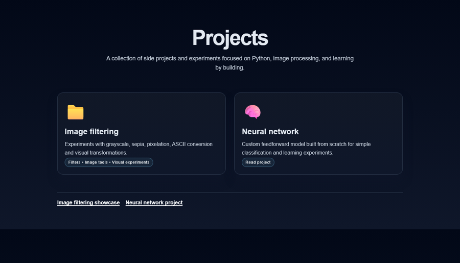

# Prosjekter

Dette repoet er en liten samling av eksperimenter, idéer og små programmer jeg har bygget for å lære, teste og utforske forskjellige konsepter. Det meste er i Python, med fokus på bildebehandling, visualisering og litt maskinlæring.

En liten nettside er laget for å vise noen av disse prosjektene på en rask og enkel måte.

<p align="center">
  <a href="./index.html" style="display:inline-block; padding:9px 16px; background:#111827; color:#f8fafc; text-decoration:none; border:1px solid #334155; border-radius:8px; font-weight:600; font-size:0.95rem;">
    Åpne nettsiden
  </a>
</p>

<p align="center">
  <a href="./index.html">
    
  </a>
</p>

Kopieres inn i en nettleser:
`http://localhost:8000/index.html`


## Kort oversikt

- [Neural Network](python/AI/NN/README.md) — et nevralt nettverk bygget fra bunnen av
- [Bildebehandling](python/image_editing/README.md) — filtre, pixelmanipulering og visuelle effekter
- [Visuelt showcase](python/showcase/README.md) — en rask visuell demo av resultatene
- [Java-eksperimenter](java/tull/README.md) — mindre prøver og små utviklingsøkter

## Kom i gang

```bash
cd python
pip install -r requirements.txt
```

Deretter kan du kjøre en av demoene:

```bash
cd python/AI/NN
python spamtest.py
```

```bash
cd python/image_editing/filters
python main.py
```

## Merk

Dette er fortsatt et arbeid under utvikling, og jeg vil gjerne utvide det med bedre beskrivelser, tydeligere eksempler og mer polerte demos over tid.

English is used in code, comments and README for consistency across the project.