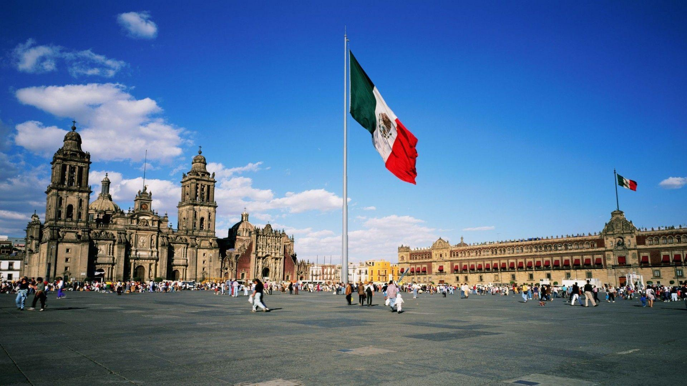
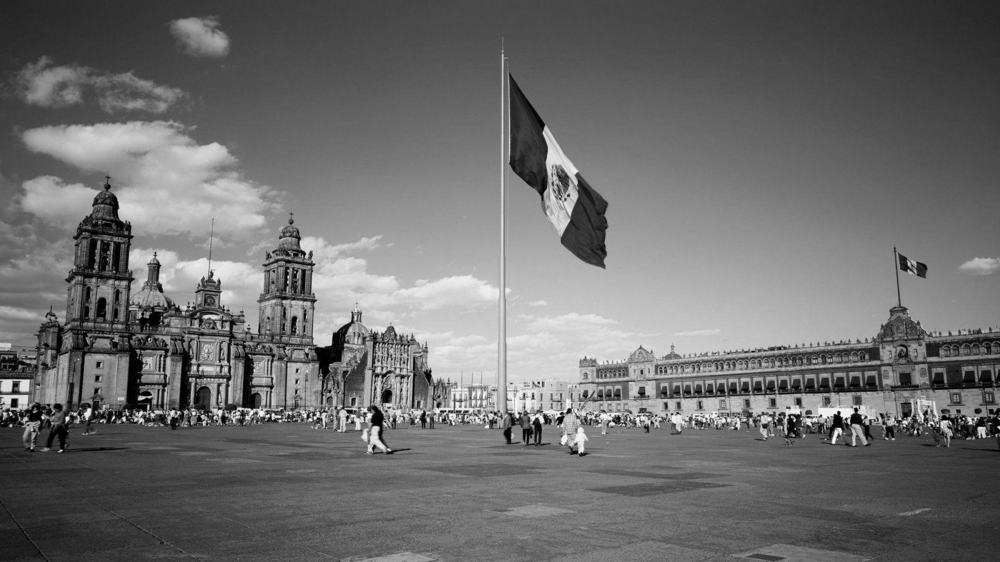
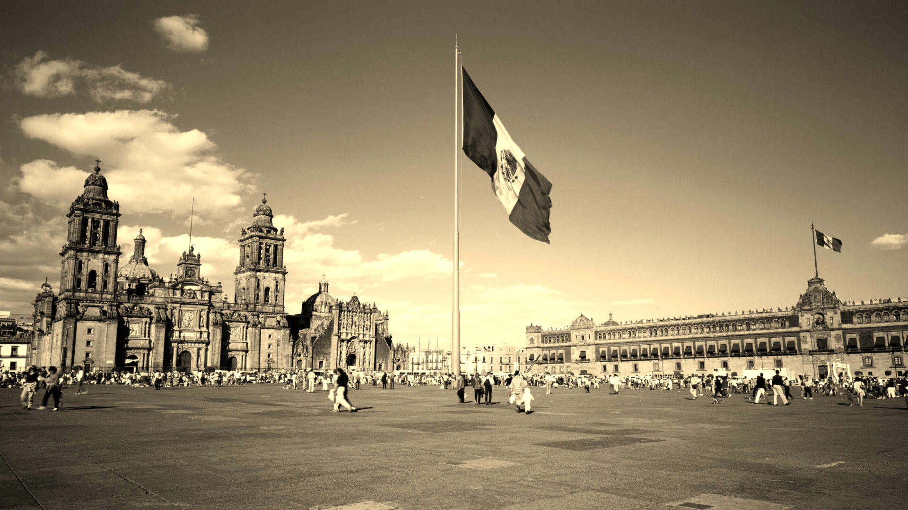
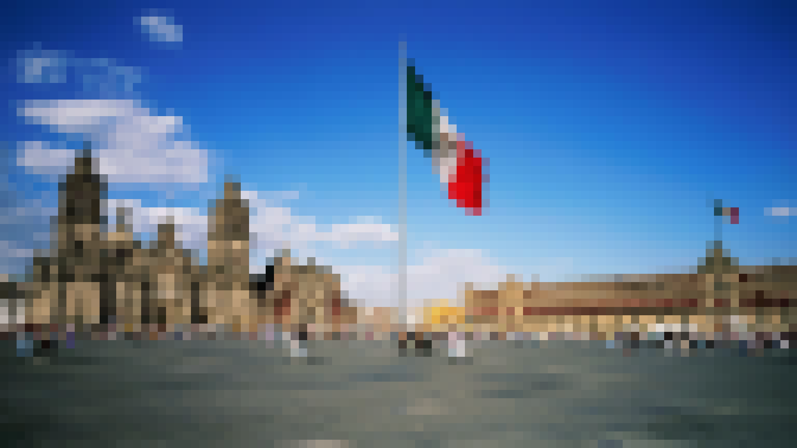
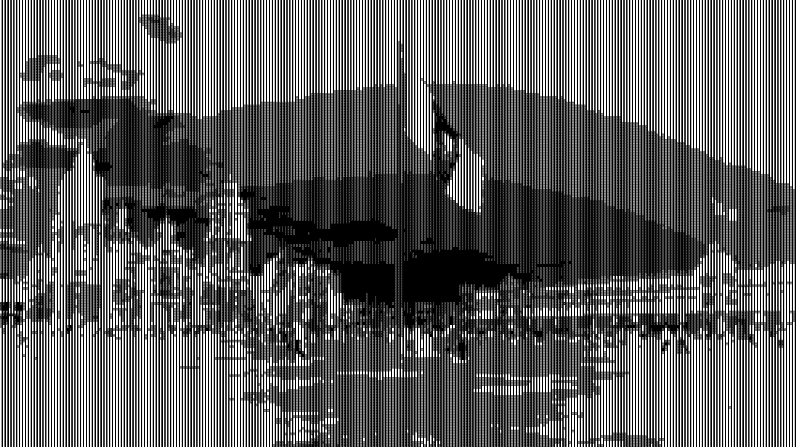

# Visuelt showcase

Dette er en liten visuell demonstrasjon av filtere og effekter som finnes i repoet. Målet er å gi et raskt bilde av hva prosjektet handler om uten at noen må laste ned og kjøre koden først.

<table>
  <tr>
    <td align="center"><strong>Original</strong><br></td>
    <td align="center"><strong>Gråskalering</strong><br></td>
  </tr>
  <tr>
    <td align="center"><strong>Sepia</strong><br></td>
    <td align="center"><strong>Pixelert</strong><br></td>
  </tr>
  <tr>
    <td align="center"><strong>ASCII</strong><br></td>
    <td align="center"><strong>Blur placeholder</strong><br></td>
  </tr>
</table>

## Hvor dette kommer fra

Bildene er generert fra `python/image_editing/images/mexico.jpg` ved hjelp av filter- og bildebehandlingslogikken i prosjektet. Det er et enkelt eksempel på hvordan koden kan brukes til å manipulere og transformere bilder.

## Kjør selv

```bash
cd python/showcase
python generate_gallery.py
```
